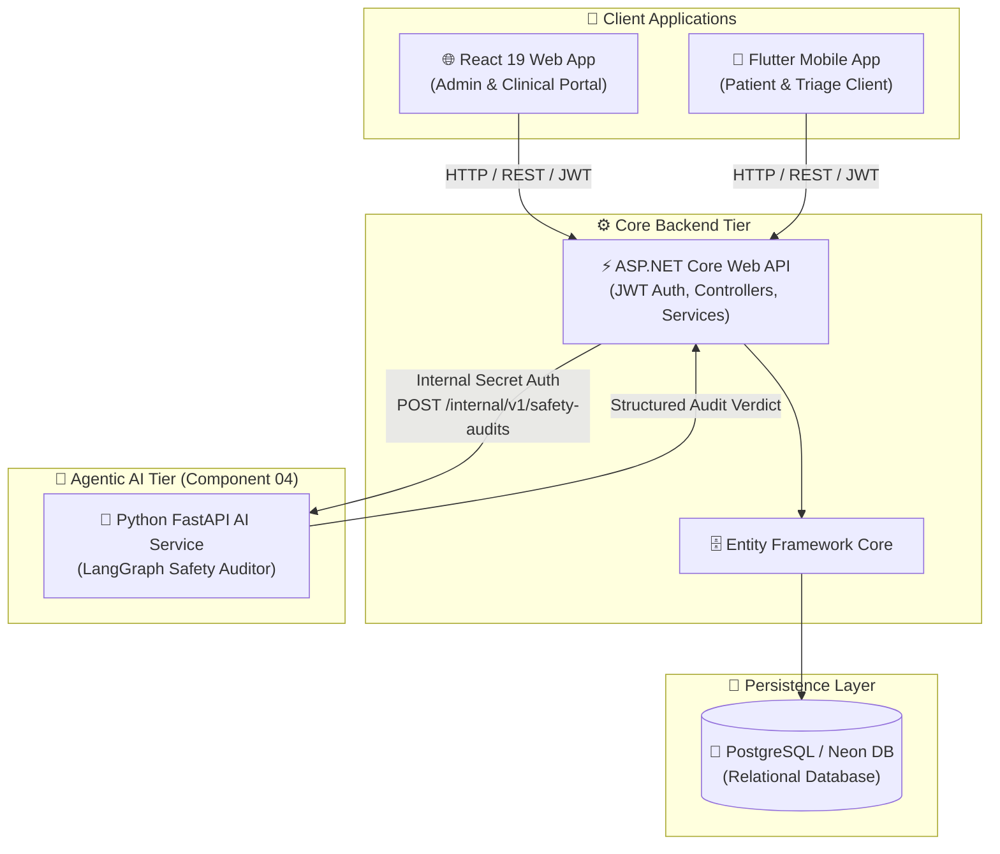

# 🏥 ChannelCenter — Integrated Full-Stack & Agentic AI Healthcare System

> **SE3090 — Software Engineering Frameworks**  
> **Academic Year:** Year 3, Semester 1 (2026) | **SLIIT**  
> **Group Assignment 1** | **Repository:** `SE3090_KDY_SE_01`

---

## 📌 Executive Summary

**ChannelCenter** is an enterprise-grade healthcare management application for doctor channeling, patient triage, appointment scheduling, and automated clinical safety auditing. 

The system unifies a cross-platform mobile client, a web administration and clinical portal, a centralized ASP.NET Core RESTful backend, a PostgreSQL relational database, and an isolated internal **Agentic AI Safety Auditor** powered by Python FastAPI and LangGraph.

---

## 🏗 System Architecture & Topology

The application enforces a strict single-backend architectural boundary. Client applications (React Web and Flutter Mobile) interact exclusively with the ASP.NET Core REST API over HTTP/REST using JWT authentication. The Agentic AI Subsystem operates as a secured internal microservice accessed exclusively by the ASP.NET Core API via mutual internal secret authentication.



---

## 💡 Tech Stack Overview

| Layer | Framework / Technology | Language | Purpose & Scope |
| :--- | :--- | :--- | :--- |
| **Backend API** | ASP.NET Core 8.0 Web API | C# | Core business logic, authentication, JWT issuing, RESTful endpoints |
| **Data Access** | Entity Framework Core | C# | ORM, database migrations, LINQ query execution |
| **Database** | PostgreSQL / Neon DB | SQL | Persistent relational data store for users, appointments, triage & audits |
| **Web Portal** | React 19 + Vite | JavaScript (ESNext) | Web portal for administrative management, doctor scheduling & intake |
| **Mobile App** | Flutter | Dart | Cross-platform mobile app for patient registration, appointments & triage |
| **Agentic AI** | FastAPI + LangGraph | Python 3.12 | Bounded `Plan -> Validate -> RiskAssess -> PauseOrComplete` audit graph |
| **Containerization** | Docker & Docker Compose | YAML / Dockerfile | Service orchestration and container deployment |

---

## ✨ Main Features & Subsystems

### 1. ⚡ ASP.NET Core Backend (`src/backend`)
* **Role-Based Auth & Access:** JWT-authenticated endpoints supporting Patient, Doctor, Nurse, and Admin roles.
* **Appointment & Schedule Engine:** Real-time doctor slot management, booking lifecycle, and ticket generation.
* **Patient Triage Integration:** Endpoint orchestration for emergency intake, urgency tagging, and safety auditing.
* **Swagger/OpenAPI:** Auto-generated interactive API documentation at `/swagger`.

### 2. 🌐 React Web Portal (`src/web`)
* **Dashboard & Metrics:** Real-time overview of clinic statistics, doctor schedules, and appointment queues.
* **Staff & Admin Management:** Patient intake management, registration tabs, and doctor availability controls.
* **Safety Audit Oversight:** Interface for viewing flagged risk workflows and pending safety verifications.

### 3. 📱 Flutter Mobile Client (`src/mobile`)
* **Patient Portal:** Doctor directory search, availability lookup, and instant appointment booking.
* **Smart Emergency Triage:** Step-by-step patient symptom intake with automatic urgency color-coded badges.
* **Live Status Tracker:** Real-time tracking of triage approval and appointment status updates.

### 4. 🤖 Agentic AI Safety Auditor (`src/ai-service`)
* **LangGraph Execution Graph:** Deterministic audit pipeline (`Plan -> Validate -> RiskAssess -> PauseOrComplete`).
* **Prompt Injection Defense:** Strict payload validation filtering unauthorized injection patterns.
* **Deterministic Risk Scoring:** Automated triage verification without reliance on dynamic external LLM outputs.

---

## 📂 Repository Structure

```
SE3090_KDY_SE_01/
├── .github/
│   └── workflows/          # GitHub Actions CI/CD pipelines
├── docs/                   # Architecture Decision Records (ADRs), specifications & specs
│   ├── Assignment Specification.md
│   ├── databaseSchema.md
│   ├── Development Roadmap.md
│   └── Componet 04/        # Detailed AI Subsystem documentation
├── src/
│   ├── backend/            # C# ASP.NET Core Web API project
│   │   └── ChannelCenter.API/
│   ├── web/                # React 19 + Vite Web Application
│   ├── mobile/             # Flutter / Dart Mobile Application
│   └── ai-service/         # Python FastAPI + LangGraph Agentic AI microservice
├── docker-compose.yml      # Multi-container local orchestration script
└── README.md               # Root documentation
```

---

## 🚀 Quick Start Guide

### Option 1: Running with Docker Compose (Recommended)

Ensure [Docker Desktop](https://www.docker.com/products/docker-desktop/) is installed and running.

```bash
# Clone repository
git clone https://github.com/IT24101970/SE3090_KDY_SE_01_Assignment_1.git
cd SE3090_KDY_SE_01

# Build and start all containerized services (PostgreSQL, AI Service, API)
docker-compose up --build -d

# Verify running services
docker-compose ps
```

* **Backend API Swagger:** `http://localhost:5000/swagger`
* **AI Subsystem Health Check:** `http://localhost:8001/health/live`
* **PostgreSQL Database:** `localhost:5432` (Database: `channel_center_db`)

---

### Option 2: Running Services Individually (Local Development)

#### 1. Backend Service (ASP.NET Core)
```bash
cd src/backend/ChannelCenter.API
dotnet restore
dotnet ef database update  # Apply database migrations
dotnet run
```
*App will launch on `http://localhost:5000` (or `http://localhost:5066`).*

#### 2. Agentic AI Service (Python FastAPI)
```bash
cd src/ai-service
python -m venv .venv
# Windows PowerShell:
.\.venv\Scripts\Activate.ps1
# Linux/macOS:
source .venv/bin/activate

pip install -r requirements-dev.txt
cp .env.example .env
uvicorn app.main:app --host 127.0.0.1 --port 8001 --reload
```

#### 3. Web Client (React + Vite)
```bash
cd src/web
npm install
npm run dev
```
*App will launch on `http://localhost:5173`.*

#### 4. Mobile Client (Flutter)
```bash
cd src/mobile
flutter pub get
flutter run
```

---

## 🔑 Environment Variables & Security Configuration

| Service | Key Name | Default / Sample Value | Description |
| :--- | :--- | :--- | :--- |
| **Backend API** | `ConnectionStrings__DefaultConnection` | `Host=localhost;Database=channel_center_db;...` | PostgreSQL Connection String |
| **Backend API** | `Jwt__SecretKey` | `ChannelCenterDevSecret_MustBe32CharsOrMore!` | HMAC-SHA256 Signing key for JWT |
| **Backend API** | `SafetyAuditor__BaseUrl` | `http://localhost:8001` | Internal URL of Python AI Subsystem |
| **Backend API** | `SafetyAuditor__InternalServiceKey` | `local-development-secret` | Shared secret for backend-to-AI calls |
| **AI Service** | `INTERNAL_SERVICE_KEY` | `local-development-secret` | Shared authentication key for incoming requests |
| **AI Service** | `PORT` | `8001` | FastAPI listening port |

---

## 🧪 Testing & Code Verification

To execute automated tests across the codebase:

```bash
# Backend ASP.NET Core Unit & Integration Tests
dotnet test src/backend/ChannelCenter.API/ChannelCenter.API.csproj

# React Web Client Unit Tests
cd src/web && npm test

# Flutter Mobile Unit & Widget Tests
cd src/mobile && flutter test

# Python AI Subsystem Tests
cd src/ai-service && pytest
```

---

## 📜 Academic Compliance & Guidelines

- **Module:** SE3090 – Software Engineering Frameworks
- **Weighting:** 25% of final module mark
- **AI Policy Level:** Level 4 — Full AI declaration. Development AI assistance used in accordance with SLIIT academic governance.

---

## 🤝 Authors & Contributors

* **SLIIT Faculty of Computing** — Department of Software Engineering & Artificial Intelligence
* **Group:** SE3090_KDY_SE_01

---

<p align="center">Made with ❤️ for SE3090 Software Engineering Frameworks</p>
