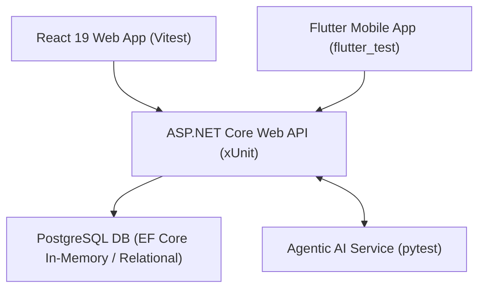

# SE3110: Software Testing & Quality Evaluation - Master Test Plan
**Project Name:** SE3090 Integrated ChannelCenter System  
**Group ID:** SE3090_KDY_SE_01  
**Academic Year:** Year 3 Semester 1 (2026)  
**Module:** SE3110 / SE3090 Software Engineering Frameworks  

---

## 1. Executive Summary & Testing Objectives
The objective of this Test Plan is to define the testing strategy, framework, scope, tools, test environment, and schedule for evaluating the integrated **ChannelCenter System**. The system consists of an **ASP.NET Core 8 Web API**, a **PostgreSQL Database**, a **React 19 Web Portal**, a **Flutter Mobile App**, and an **Agentic AI Subsystem**.

### Key Testing Goals:
1. Ensure full end-to-end integration and data consistency across Web, Mobile, API, DB, and AI layers.
2. Validate business rules for doctor slot booking, patient triage, and clinical review workflows.
3. Verify robust error handling for edge cases, invalid inputs, unauthenticated requests, and prompt injection attacks.
4. Measure system performance, API response latency, and throughput under concurrent user load.
5. Provide automated test execution evidence and defect retesting validation.

---

## 2. System Architecture & Testing Scope

### In-Scope Technical Testing Areas:

| Testing Area | Target Components | Primary Tools / Frameworks | Lead Owner | Test Objectives |
| :--- | :--- | :--- | :--- | :--- |
| **Backend API (Appointments & Patients)** | `AppointmentsController`, `PatientsController` | xUnit, Moq, EF Core | **Shashika** | Patient registration, slot booking generation, auth checks, history filtering. |
| **Backend API (Doctor Scheduling)** | `DoctorSchedulesController`, `DoctorsController`, `DoctorLeavesController`, `ConsultationRoomsController` | xUnit, EF Core | **Thanuja** | Doctor schedule creation, room conflict detection, doctor profile creation, leave approval. |
| **Backend API (Triage & Scoring)** | `TriageController`, `TriageService` | xUnit, EF Core | **Imasha** | Urgency scoring calculation, symptom intake submission, severity rating logic. |
| **Backend API (Admin & Safety Audit)** | `AdminController`, `InternalSafetyAuditorController` | xUnit, EF Core | **Kavindu** | System overview analytics, admin override approval, audit trail logging. |
| **React Web Application** | React 19 Frontend Components | Vitest, React Testing Library, jsdom | **Shashika / Thanuja / Imasha / Kavindu** | Component rendering, modal auto-selection, real-time table filter, clinical review board, audit console. |
| **Flutter Mobile Application** | Flutter Mobile App Screens | `flutter_test`, Provider stubs | **Shashika / Thanuja / Imasha / Kavindu** | Widget rendering, screen navigation, input field validation, role-based dashboards. |
| **Agentic AI Testing** | Python AI Subsystem | `pytest`, Pydantic | **Shashika / Thanuja / Imasha / Kavindu** | Intake parsing (Shashika), Schedule optimization (Thanuja), Triage matching (Imasha), Safety audit (Kavindu). |
| **Non-Functional & E2E Testing** | Load, Security & Cross-Component Flow | k6, OWASP ZAP / Security Scripts | **Kavindu** | Concurrency load (50 VUs), response latency (< 300ms p95), security header & prompt injection defense. |

---

## 3. Test Environment & Prerequisites

- **Development OS:** Windows 11 x64
- **Runtime Environment:** .NET 8 SDK, Node.js v20+, Python 3.13, Flutter SDK 3.x
- **Test Runners:** `dotnet test`, `npm run test` (Vitest), `pytest`, `flutter test`, `k6 run`
- **Database Environment:** Entity Framework Core In-Memory Provider & PostgreSQL

---

## 4. Test Strategy & Methodology

### 4.1 Unit & Service Testing
- **Backend:** Mock dependencies (`Moq`) and use isolated DbContexts per test run to prevent test pollution.
- **Frontend (Web/Mobile):** Mock API layer endpoints (`vi.mock`, `TestAuthProvider`) to isolate component UI state logic from network failures.

### 4.2 Integration & E2E Testing
- Execute cross-module workflows asserting that data generated by the AI subsystem is correctly parsed, serialized, and persisted by ASP.NET Core services.

### 4.3 Non-Functional Testing
- **Performance:** Run automated k6 scripts testing 50 virtual users executing concurrent appointment searches and triage submissions over 50 seconds.
- **Security:** Execute automated security test scripts inspecting authorization boundaries, SQL injection resistance, and LLM prompt jailbreak attempts.

---

## 5. Team Member Roles & Responsibilities Matrix

| Team Member | Component Focus (Development Roadmap) | Test Suite Ownership | Deliverables |
| :--- | :--- | :--- | :--- |
| **Shashika** | Component 1: Patient & Booking System | `AppointmentsControllerTests.cs`, `PatientTests.cs`, `SlotBookingModal.test.jsx`, `PatientDirectoryTab.test.jsx`, `test_intake_agent.py`, Mobile Patient Booking tests | Patient API & UI test suites, BUG-01 & BUG-02 fix evidence |
| **Thanuja** | Component 2: Doctor Scheduling System | `DoctorSchedulesControllerTests.cs`, `DoctorsControllerTests.cs`, `DoctorLeavesControllerTests.cs`, `ConsultationRoomsControllerTests.cs`, `AppointmentDirectoryTab.test.jsx`, `test_appointment_rules.py`, Mobile Doctor Agenda tests | Doctor Scheduling API & UI test suites, BUG-03 fix evidence |
| **Imasha** | Component 3: Urgency & Triage System | `TriageControllerTests.cs`, `ClinicalReviewView.test.jsx`, `test_triage_agent.py`, Mobile Symptom Wizard tests | Triage API, AI agent & Clinical Board test suites |
| **Kavindu** | Component 4: AI Audit, Safety & Load | `AdminControllerTests.cs`, `AuditTrailTab.test.jsx`, `IntakeAgentConsoleTab.test.jsx`, `test_security.py`, `test_security_audit.py`, `test_integrated_workflow.py`, `k6_load_test.js` | Admin API, AI Audit & k6 Performance Load & Security test suites |

---

## 6. Execution Schedule & Milestone Tracking

| Milestone Phase | Planned Date | Status |
| :--- | :--- | :--- |
| **Test Strategy & Environment Setup** | Sept 25, 2026 | Completed |
| **Unit & Service Test Suite Execution** | Oct 01, 2026 | Completed |
| **Defect Identification & Retesting** | Oct 04, 2026 | Completed |
| **Non-Functional & E2E Test Execution** | Oct 06, 2026 | Completed |
| **Final Documentation & Viva Prep** | Oct 07, 2026 | Completed |
