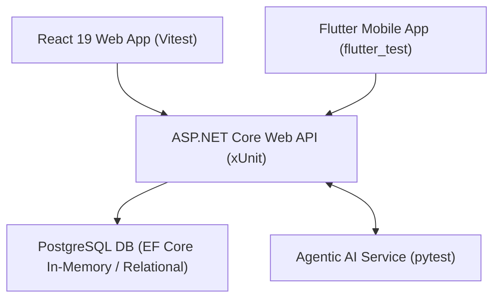

# SE3110: Software Testing & Quality Evaluation - Master Test Plan
**Project Name:** SE3090 Integrated ChannelCenter System  
**Academic Year:** Year 3 Semester 1 (2026)  
**Module:** SE3110 / SE3090 Software Testing and Quality Evaluation  

---

## 1. Executive Summary & Testing Objectives
The objective of this Test Plan is to define the testing strategy, framework, scope, tools, test environment, and schedule for evaluating the integrated **ChannelCenter System**. The system consists of an **ASP.NET Core 8 Web API**, a **PostgreSQL Database**, a **React 19 Web Portal**, a **Flutter Mobile App**, and an **Agentic AI Subsystem**.

### Key Testing Goals:
1. Ensure full end-to-end integration and data consistency across Web, Mobile, API, DB, and AI layers.
2. Validate business rules for doctor slot booking, patient triage, and clinical review workflows.
3. Verify robust error handling for edge cases, invalid inputs, unauthenticated requests, and prompt injection attacks.
4. Measure system performance, API response latency, and throughput under concurrent user load.
5. Provide automated test execution evidence and defect retesting validation.

---

## 2. System Architecture & Testing Scope

### In-Scope Technical Testing Areas:

| Testing Area | Target Components | Primary Tools / Frameworks | Test Objectives |
| :--- | :--- | :--- | :--- |
| **Backend / API Testing** | ASP.NET Core Controllers, Services, DTOs | xUnit, Moq, EF Core | Unit & integration testing of appointment booking, patient profiles, triage claims, auth checks. |
| **Database Testing** | EF Core DbContext, PostgreSQL models | xUnit + EF Core In-Memory | Referential integrity, cascade constraints, unique indexes, transaction handling. |
| **React Web Application** | Admin & Staff Web Console | Vitest, React Testing Library, jsdom | UI component state, form validation, modal popups, directory filters, async actions. |
| **Flutter Mobile Application** | Mobile Patient & Staff App | `flutter_test`, Provider stubs | Widget rendering, screen navigation, input field validation, role-based dashboards. |
| **Agentic AI Testing** | Python AI Subsystem | `pytest`, Pydantic | Symptom triage accuracy, specialty matching, severity index, prompt injection defense. |
| **Integrated E2E Testing** | Multi-tier Workflow | Python integration scripts, Vitest | End-to-end flow: Symptom Triage -> AI Assessment -> Doctor Slot Lock -> Audit Trail. |
| **Non-Functional Testing** | Backend API & AI Endpoints | k6, OWASP ZAP / Security Scripts | Concurrency load (50 VUs), response latency (< 300ms p95), security header validation. |

---

## 3. Test Environment & Prerequisites

- **Development OS:** Windows 11 x64
- **Runtime Environment:** .NET 8 SDK, Node.js v20+, Python 3.13, Flutter SDK 3.x
- **Test Runners:** `dotnet test`, `npm run test` (Vitest), `pytest`, `flutter test`, `k6 run`
- **Database Environment:** Entity Framework Core In-Memory Provider & PostgreSQL

---

## 4. Test Strategy & Methodology

### 4.1 Unit & Service Testing
- **Backend:** Mock dependencies (`Moq`) and use isolated DbContexts per test run to prevent test pollution.
- **Frontend (Web/Mobile):** Mock API layer endpoints (`vi.mock`, `TestAuthProvider`) to isolate component UI state logic from network failures.

### 4.2 Integration & E2E Testing
- Execute cross-module workflows asserting that data generated by the AI subsystem is correctly parsed, serialized, and persisted by ASP.NET Core services.

### 4.3 Non-Functional Testing
- **Performance:** Run automated k6 scripts testing 50 virtual users executing concurrent appointment searches and triage submissions over 50 seconds.
- **Security:** Execute automated security test scripts inspecting authorization boundaries, SQL injection resistance, and LLM prompt jailbreak attempts.

---

## 5. Roles & Responsibilities Matrix

| Team Member Role | Assigned Testing Areas | Deliverables |
| :--- | :--- | :--- |
| **Backend Developer / QA Lead** | ASP.NET Core xUnit tests, DB Integration, k6 Load Testing | `ChannelCenter.Tests`, `k6_load_test.js`, Performance Graphs |
| **Frontend QA Engineer** | React Web Vitest suites, Component & Modal tests | `src/web/src/test/*.test.jsx`, Web Test Evidence |
| **Mobile QA Engineer** | Flutter `flutter_test` widget & screen validation | `src/mobile/test/widget_test.dart`, Mobile Execution Logs |
| **AI Systems QA Specialist** | Agentic AI `pytest` suites, Prompt Injection Defense | `src/ai-service/tests/*`, AI Evaluation Summary |

---

## 6. Execution Schedule & Milestone Tracking

| Milestone Phase | Planned Date | Status |
| :--- | :--- | :--- |
| **Test Strategy & Environment Setup** | Sept 25, 2026 | Completed |
| **Unit & Service Test Suite Execution** | Oct 01, 2026 | Completed |
| **Defect Identification & Retesting** | Oct 04, 2026 | Completed |
| **Non-Functional & E2E Test Execution** | Oct 06, 2026 | Completed |
| **Final Documentation & Viva Prep** | Oct 06, 2026 | Completed |
